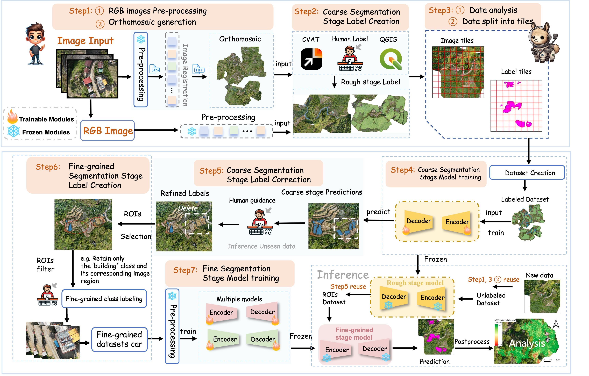
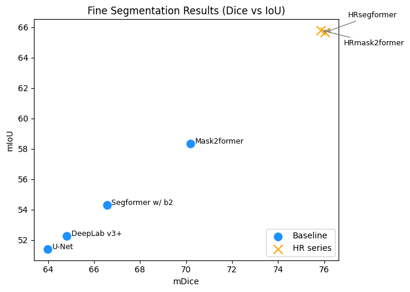
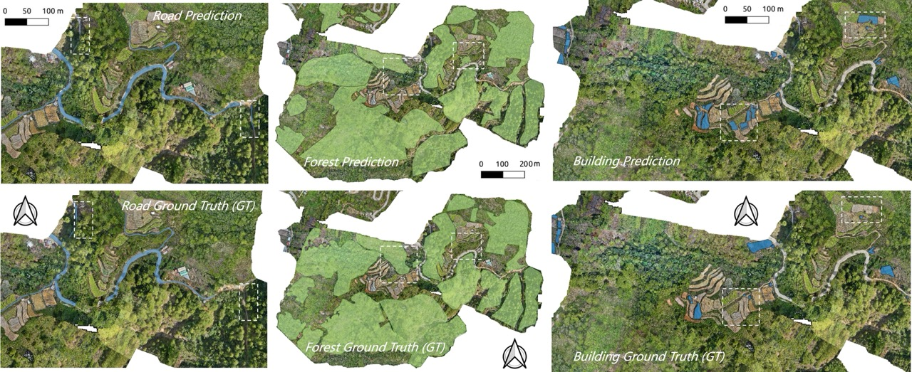

<h1 align="center">
  
</h1>

## VHR-Seg: A Coarse-to-Fine Deep Learning Framework for Semantic Segmentation in Very High Resolution Remote Sensing Imagery

This GitHub repository contains the code for my independent research project at Imperial College London. It is integrated with [MMsegmentation](https://github.com/open-mmlab/mmsegmentation) and provides a reproducible, modular pipeline for semantic segmentation on VHR (very high resolution) UAV/orthophoto imagery, featuring a two-stage coarse-to-fine workflow and HR-series models (HRSegFormer / HRMask2Former).

## Overview

Very high-resolution (VHR) remote sensing image semantic segmentation holds great potential for applications in ecological conservation, urban management, and many other domains. However, **the large scale of VHR imagery**, **the high annotation cost**, and **the lack of standardized workflows** present major challenges for semantic segmentation. 

As a result, most existing deep learning approaches are restricted to specific datasets, which limits their cross-domain
applicability. To address these challenges, a two-stage coarse-to-fine segmentation framework, VHR-Seg, is proposed. The framework provides end-to-end functionalities including automated geospatial data processing, model training and inference, and annotation guidance. Segmentation can be performed according to user-defined regions of interest. The designed High-Resolution (HR) series models embedded in the framework effectively capture fine details while preserving
contextual semantic information, enabling fine-grained segmentation of VHR imagery.

<h1 align="center">
  
</h1>

HR-Series model enable detect small objects and preserving fine segmentation details. In fine segmentation stage, it significantly improves the performance **by +14.42 mIoU** and **by 12.05 mDice**, resulting in an unprecedented performance of 65.80 and 76.04, respectively.

<h1 align="center">
  
</h1>

## Installation

VHR-Seg is developed and tested primarily on Linux, based on the Imperial College London HPC platform. Future work will focus on extending support to Windows and macOS. Please refer to [Installation.md](instruction/Installation.md) for installation

## Get start

Please see [Labeling](instruction/Labeling.md) and [Labeling instructions](instruction/Labeling_instructions.md) for the coarse and fine stage labeling.

Please see [user guides](https://mmsegmentation.readthedocs.io/en/latest/user_guides/index.html#) for the basic usage of MMSegmentation.

There are also [Quick start](instruction/start.md) for start using the VHR-Seg

## Development

### Generating documentation

Build modules (only if any modules were changed):

```shell
sphinx-apidoc -M -f -o docs/ ./vhrsegment
```

Generate documentation:

```shell
python -m sphinx -b html docs/ docs/_build/
```

After building, you can open the HTML documentation from `docs/_build/index.html`.

### Running tests

Please note that some tests in `tests/functional` are computationally expensive
and may take longer to complete on CPU-only systems. Using a dedicated GPU is recommended.

To run tests:
```shell
pytest
```

### Linting with flake8

```shell
python -m flake8
```

### Type checking with Pytype

```shell
python -m pytype
```

### Regenerating `requirements.txt`

```shell
uv pip compile --universal --output-file=requirements.txt requirements.in
```

Afterwards, sync the requirements:

```shell
uv pip sync requirements.txt

mim install "mmcv==2.0.0"
pip install git+https://github.com/open-mmlab/mmsegmentation@30a3f94f3e2916e27fa38c67cc3b8c69c1893fe8
pip install git+https://github.com/open-mmlab/mmdetection@ecac3a77becc63f23d9f6980b2a36f86acd00a8a

mamba uninstall GDAL -y
mamba install GDAL==3.7.2 -y
```

## Results

### Coarse Segmentation Results
The VHR-Seg mainly trained to classify three coarse classes, Road, forest and Buildings. And the visualizaion of the segmentation results is displayed below:
<h1 align="center">
  
</h1>


### Fine Segmentation Results
The VHR-Seg mainly trained to classify three fine-grained classes, Car, Banana tree and Palm tree. And the visualizaion of the segmentation results is displayed below:
<h1 align="center">
  
</h1>

## Test
Download the models from the [GoogleDrive](https://drive.google.com/drive/folders/12W6eRZP4dZX7gSal6hwOu3mDc4_PY0RH?usp=drive_link). And make sure you install the package successfully, and you can download the model weights and save them into the right folder. 

## Acknowledgements

VHRS-Seg is based on the following open-source projects. We thank their authors for making the source code publicly available.

* [HRDA](https://github.com/lhoyer/HRDA)
* [MMSegmentation](https://github.com/open-mmlab/mmsegmentation)
* [SegFormer](https://github.com/NVlabs/SegFormer)
* [Ecomapper](https://github.com/hcording/ecomapper)


## License

This project is released under the [MIT license](LICENSE). 
