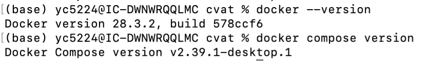
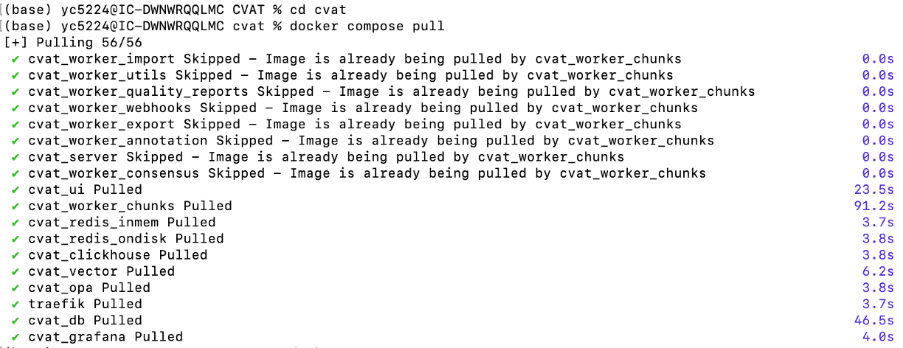
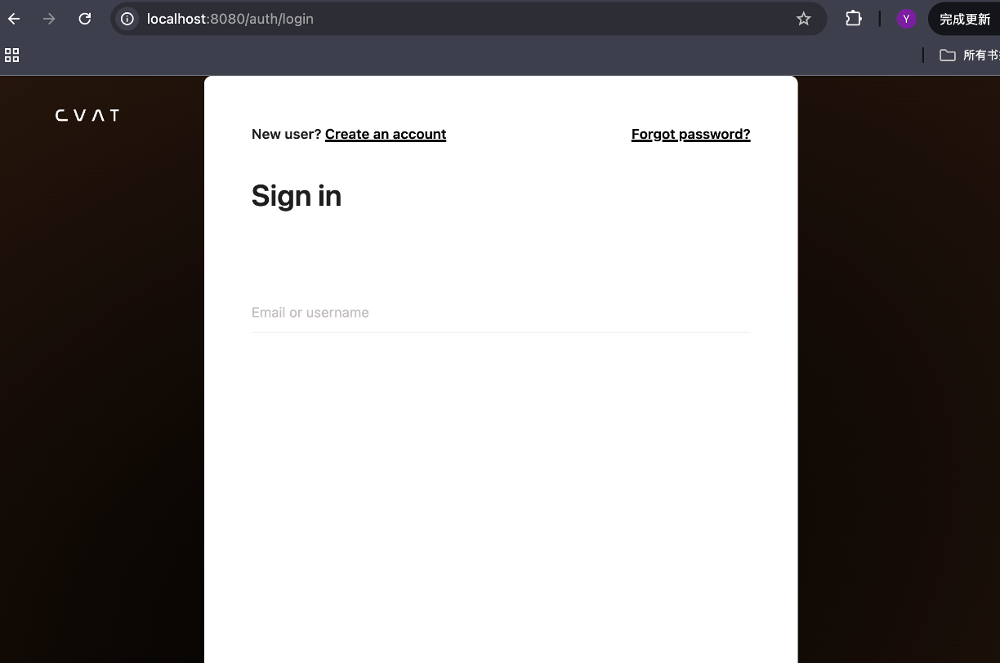
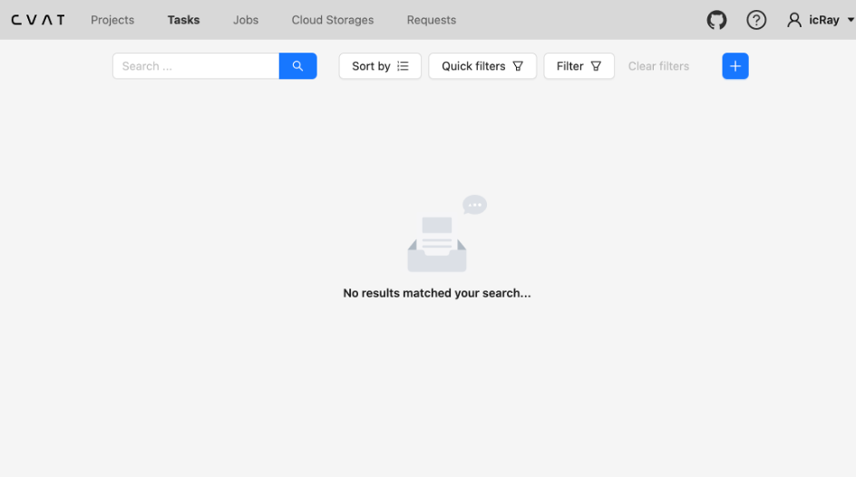

# Labeling instructions
To reproduce the whole datasets and experiments, base on our customed datasets, we need to label our own datasets for the model training and testing. The detail labeling instructions will be listed as follows:
## Labeling tools install
In this project, we need to download the [QGIS](https://qgis.org/) for the Geotiff data labeling and [CVAT]((https://github.com/cvat-ai/cvat)) for dataset spliting and Jpg format images labeling. Firstly, here is a thorought instructions to install the [CVAT](https://github.com/cvat-ai/cvat).
###  CVAT tools install instructions
CVAT is a annotation tool that designed for the deep learing and machine learing dataset preparation. we use it to prepare our own dataset.
#### 🐳 docker tools install
In order to install the CVAT successfully, we had better to firstly install the [docker](https://github.com/docker), which will make sure that CVAT can run without to consider the computer's system difference. 
#### macOS / Windows
1. Download and install **Docker Desktop** from the [official website](https://www.docker.com/products/docker-desktop/).
2. Launch **Docker Desktop** and make sure the status bar shows **Engine running**.
#### Linux (Ubuntu example)
```bash
sudo apt-get update
sudo apt-get install ca-certificates curl gnupg lsb-release -y

# Add Docker GPG key
sudo mkdir -m 0755 -p /etc/apt/keyrings
curl -fsSL https://download.docker.com/linux/ubuntu/gpg | sudo gpg --dearmor -o /etc/apt/keyrings/docker.gpg

# Add Docker repository
echo \
  "deb [arch=$(dpkg --print-architecture) signed-by=/etc/apt/keyrings/docker.gpg] https://download.docker.com/linux/ubuntu \
  $(lsb_release -cs) stable" | sudo tee /etc/apt/sources.list.d/docker.list > /dev/null

sudo apt-get update
sudo apt-get install docker-ce docker-ce-cli containerd.io docker-buildx-plugin docker-compose-plugin -y

# Start and enable Docker
sudo systemctl start docker
sudo systemctl enable docker

docker compose ps

docker --version
docker compose version
```
Here will give an example that when you successfully install the Docker, you will find that as this image.


####  Clone CVAT Repository
Firstly you need to create a new folder to store the CVAT package and after you create the new folder you can open the terminal in this folder. For example, in my personal laptop, I create a new folder named the `CVAT` in the desktop， and open the terminal in this folder by running the command lines `cd CVAT`. After that yopu can run the command lines as follows:
```bash
git clone https://github.com/opencv/cvat.git
cd cvat
```
####  Start CVAT
```bash
docker compose pull
docker compose up -d
# Check container status
docker compose ps
```
If you run this install and start it successfully, you will get the command lines output like this:


#### Open CVAT
Open your browser and go to:
```bash
http://localhost:8080
```
And you will go the login/sign up page, the image will be listed as follows:

If you are the first time to run the CVAT, you can sign up at this time, you will can create an account by provding your email. And after that, you can navigte to the CVAT UI and create your own dataset task.



