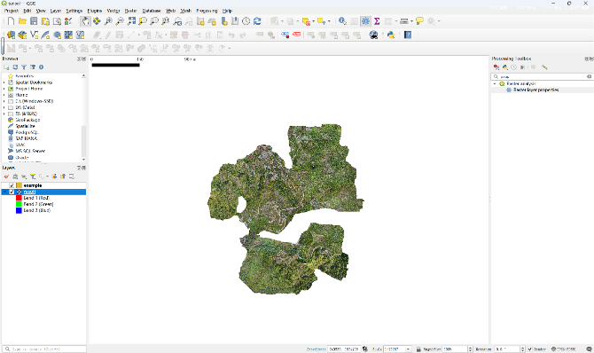
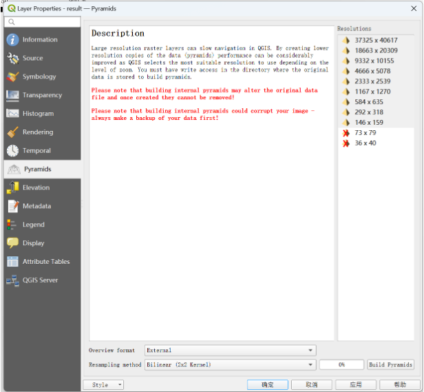
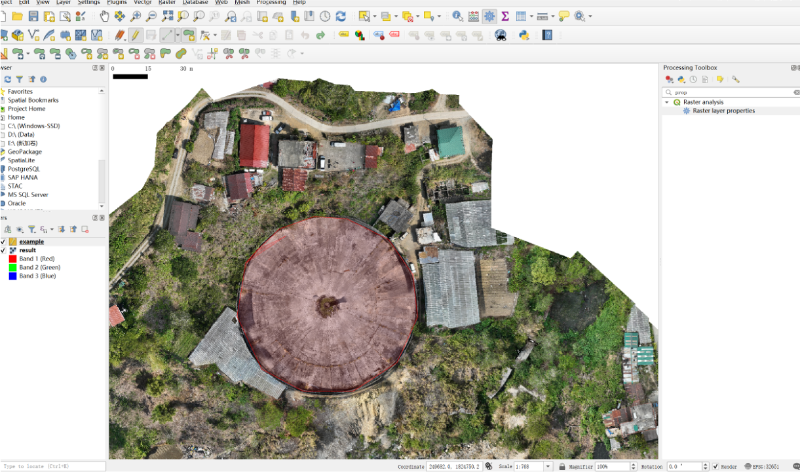
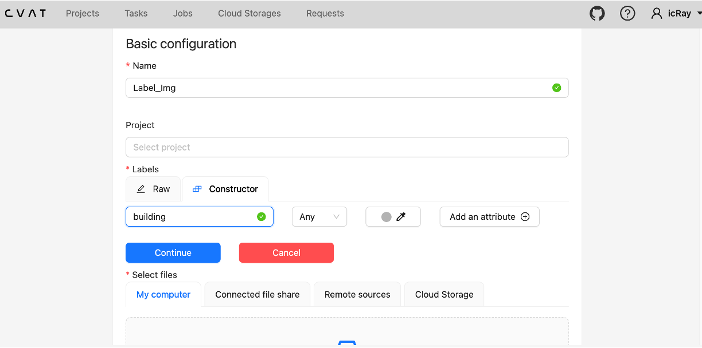
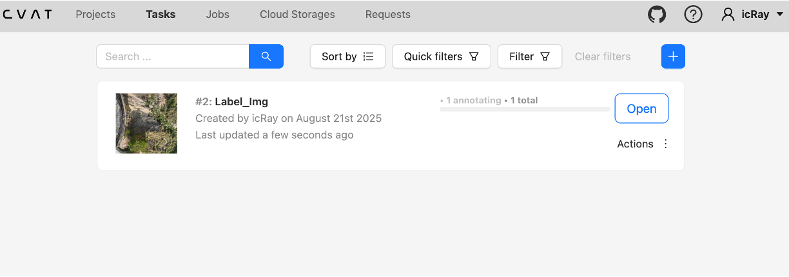
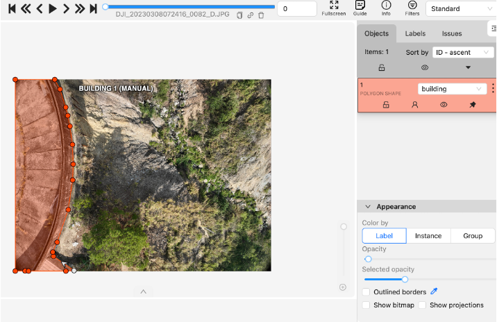

# Dataset Labeling Instructions

This guide provides comprehensive instructions for setting up the necessary tools to label custom datasets for model training and testing.

## 1 Overview

To reproduce datasets and experiments, we need to label our custom datasets using specialized tools:

- **[QGIS](https://qgis.org/)** - For GeoTIFF data labeling
- **[CVAT](https://github.com/cvat-ai/cvat)** - For dataset splitting and JPG format image labeling

## 2 Installing Labeling Tools

### 2.1 CVAT Installation Guide

CVAT (Computer Vision Annotation Tool) is designed for deep learning and machine learning dataset preparation. Follow these steps for installation:

#### 2.1.1 Prerequisites: Docker Installation

Docker is required to run CVAT reliably across different operating systems.

##### macOS / Windows

1. Download and install **Docker Desktop** from the [official website](https://www.docker.com/products/docker-desktop/)
2. Launch **Docker Desktop** 
3. Verify the status bar shows **"Engine running"**

##### Linux (Ubuntu)

```bash
# Update package index
sudo apt-get update
sudo apt-get install ca-certificates curl gnupg lsb-release -y

# Add Docker GPG key
sudo mkdir -m 0755 -p /etc/apt/keyrings
curl -fsSL https://download.docker.com/linux/ubuntu/gpg | sudo gpg --dearmor -o /etc/apt/keyrings/docker.gpg

# Add Docker repository
echo \
  "deb [arch=$(dpkg --print-architecture) signed-by=/etc/apt/keyrings/docker.gpg] https://download.docker.com/linux/ubuntu \
  $(lsb_release -cs) stable" | sudo tee /etc/apt/sources.list.d/docker.list > /dev/null

# Install Docker
sudo apt-get update
sudo apt-get install docker-ce docker-ce-cli containerd.io docker-buildx-plugin docker-compose-plugin -y

# Start and enable Docker service
sudo systemctl start docker
sudo systemctl enable docker

# Verify installation
docker --version
docker compose version
```

##### Verification

After successful installation, you should see output similar to this:


#### 2.1.2 CVAT Setup Process

#####  Clone CVAT Repository

Create a dedicated folder for CVAT and navigate to it:

```bash
# Create and navigate to CVAT directory
mkdir CVAT && cd CVAT

# Clone the repository
git clone https://github.com/opencv/cvat.git
cd cvat
```

##### Start CVAT Services

```bash
# Pull Docker images
docker compose pull

# Start CVAT in detached mode
docker compose up -d

# Verify container status
docker compose ps
```

Successful installation will produce output similar to:


##### Access CVAT Interface

Open your web browser and navigate to:

```
http://localhost:8080
```

You'll see the login/signup page:

<p align="center">
    
</p>

##### Initial Setup

- **First-time users**: Create an account by providing your email address
- **Existing users**: Log in with your credentials

After logging in, you'll access the main CVAT interface where you can create dataset tasks:

<p align="center">
    
</p>

### 2.2 QGIS Installation Guide
[QGIS](https://qgis.org/) is a full-featured, user-friendly, free-and-open-source (FOSS) geographical information system (GIS) that runs on Unix platforms, Windows, and MacOS. And we need to use this tool to load and label the geotiff format dataset， and here will give the instrucitons of how to install the QGIS (take an example in Macos).

#### 2.2.1 Choose a version
- **Long Term Release (LTR)**: more stable; recommended for most users.
- **Current/Latest**: newest features; good for early adopters.
- **CPU architecture**: Apple Silicon (M1/M2/M3) → **arm64** installer; Intel → **x86_64** installer.

#### 2.2.2 Installation Steps
1. Go to the official QGIS download page and grab the **`.dmg` installer** matching your architecture and desired version.  
2. Double-click the `.dmg`, then **drag the QGIS icon into Applications**.
3. Open **Applications → QGIS**. On first launch you may get a security prompt (see next section).

> Alternative: **Homebrew**
> ```bash
> brew install --cask qgis
> ```
> If you hit dependency/graphics issues, switch to the official `.dmg`.

> **Congratulations**: You have successfully finished installing the labeling tools for this project. And you can create your own datasets and use our project to achieve the coarse-to-fine segmentation and do practical applications based on our project.

## 3 Dataset Labeling

### 3.1 Label the tiff files in QGIS
After installing the QGIS, we can upload our tiff file in QGIS, First you can create a blank project. And then drag the `result.tiff` inside the application.
 <p align="center">
    
</p>

> **Note**: The very high resolution tiff file is very huge, so we had better create the pyramids for this data. 

we can select the tiff file layer's `Layers->Layers->Pyramids`. It will generate the pyramids images for this file and will make it will be loaded much faster next time when you open this project. 
 <p align="center">
    
</p>

> **Note**: We can choose different resampling methods in the pyramids build. If you have a decent CPU, it will be better to use the Cubic method. Considering the time cost and computational cost, I use the Bilinear method in this example. 

After create the pyramids, we can label the dataset. By clicking the `Layers->Add Layers->Raster Layers`. You will get a new layer that is different from the data layer and create the labels in this layer.
 <p align="center">
    
</p>
After labeling the whole dataset, we can export the Labels and data as the model training or testing dataset.

> **Note**: We can use CVAT help us to split the data into the train, validation and test datasets.

### 3.2 Label the image files in CVAT
we can by create the task to start the labeling operations in the CVAT. Firstly, we need to upload the dataset to CVAT.

 <p align="center">
    
</p>

> **Note**: We need to choose the `Polygan` to create the label.

 <p align="center">
    
</p>

Here is an example for the CVAT to label the image.

 <p align="center">
    
</p>

And after labeling, we can export the label as COCO format. And the labeling task is finished successfully, we can use this dataset to train or test the model.

## Citation
> [[1] CVAT documentation: "How to use the CVAT to label image / Installation of CVAT "](https://github.com/cvat-ai/cvat)

> [[2] QGIS documentation: "How to use the QGIS to label Geofile / Installation of QGIS "](https://qgis.org/)

> [[3] The series of Labelling for Deep Learning with QGIS](https://www.youtube.com/playlist?list=PLpVXG8nY0_inhvIa8aV7kWRqr4RjWe5BU)


